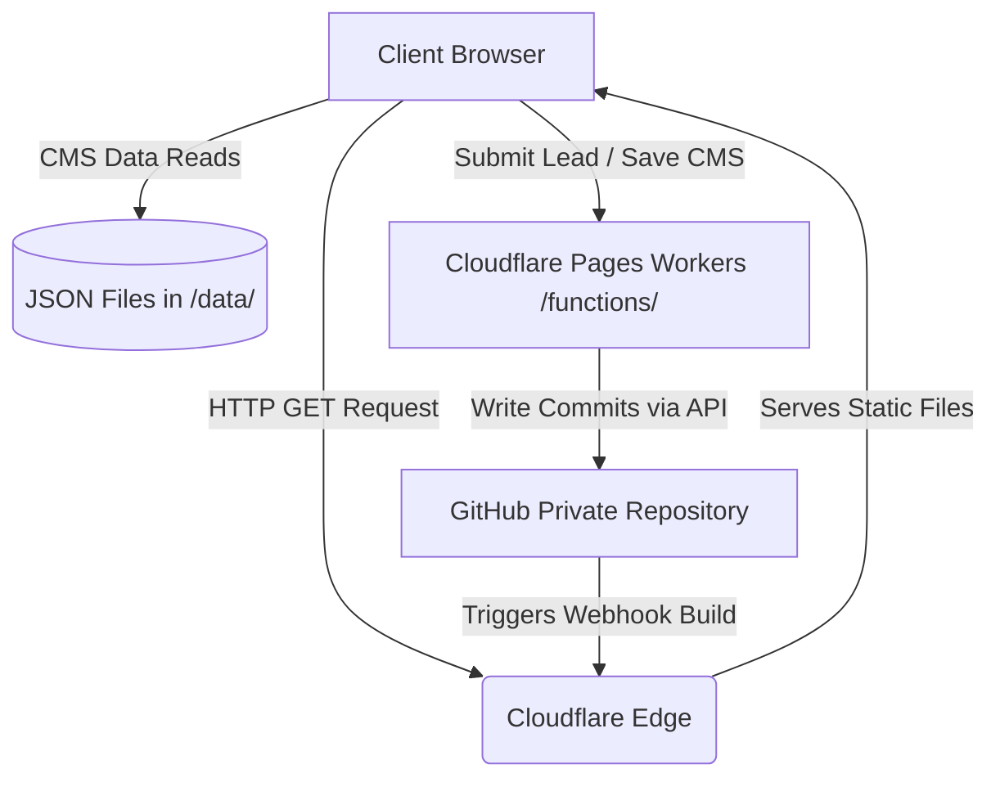

# Agency Website Template Replication Playbook

This playbook outlines the serverless architecture of the **NRSR & Co** website skeleton. Use this blueprint to duplicate, deploy, and redesign new agency websites for clients in minutes under a **$0/month hosting cost constraint** using Cloudflare Pages and GitHub.

---

## 🏗️ Core Architecture Blueprint

The website functions as a **Git-as-a-Database (GaaD)** content management system. It has no standard SQL database, no running Node servers, and no paid hosting plans.



### Authentication & Authorization Layers
1.  **Outer Gate (Zero Trust)**: Cloudflare Access intercepts browser traffic. Only whitelisted email addresses can load `admin.html` after entering a One-Time PIN (OTP).
2.  **Inner Gate (Auto-Login)**: Once validated at the edge, the website silently reads the authenticated JWT from the browser's HttpOnly cookie, bypasses login forms, and boots the CMS dashboard.
3.  **Write Layer (Serverless Commits)**: Serverless Edge Workers read your private Personal Access Token (`GITHUB_PAT`) from Cloudflare's secure dashboard environment variables and commit JSON changes to GitHub on behalf of the user. The client needs no GitHub account!

---

## 📁 Directory & File Manifest

Include the following folders and files in your project skeleton zip:

```
├── about.html                   # About company section
├── admin.html                   # Clean CMS admin dashboard
├── agency_replication_playbook.md # This blueprint handbook
├── assets/                      # Shared SVGs, logos, and images
│   └── logo.svg                 # Primary vector logo
├── blog-detail.html             # Dynamic blog detail reader with SEO JSON-LD
├── blogs.html                   # Blog archive page
├── careers.html                 # Careers page
├── case-studies.html            # Case studies archive
├── case-study-detail.html       # Dynamic case study reader with SEO JSON-LD
├── contact.html                 # Lead contact form
├── css/
│   └── style.css                # Base stylesheet (variables, fonts, grids)
├── data/                        # Local DB folder (overwritten via GitHub commits)
│   ├── blogs-index.json         # Index of blog articles
│   ├── blogs/                   # Folder with individual blog details
│   ├── case_studies-index.json  # Index of case study articles
│   ├── case_studies/            # Folder with individual case study details
│   ├── faqs.json                # FAQs dataset
│   ├── leads/                   # Folder where contact lead forms commit JSONs
│   ├── services.json            # Dynamic offerings dataset (16 offerings)
│   ├── settings.json            # Global settings (WhatsApp list, ERP endpoint)
│   └── testimonials.json        # Reviews dataset
├── functions/                   # Cloudflare Pages Workers (runs serverless at edge)
│   ├── auth.js                  # GitHub OAuth authentication gateway (fallback)
│   ├── callback.js              # GitHub OAuth callback gateway (fallback)
│   ├── github_proxy.js          # Secure API proxy for read/delete actions
│   ├── save_content.js          # Secure API committer for JSON database
│   ├── submit_lead.js           # Lead submissions logger + Actions dispatcher
│   └── verify_cf_session.js     # Zero Trust cookie session authenticator
├── index.html                   # Website landing page
├── industries.html              # Target industries page
├── js/
│   ├── admin.js                 # CMS dashboard views, forms, and handlers
│   ├── main.js                  # Core main UI logic (lazy load, SEO tags, forms)
│   └── store.js                 # Central database, localStorage, and Git pusher
├── robots.txt                   # Search crawler directives
├── services/                    # Specialized landing pages for core offerings
│   └── ...                      # Sub-services HTML templates
├── sitemap.xml                  # SEO search index map
└── team.html                    # Team page
```

---

## 🚀 Setup & Deployment Guide

Follow these steps to deploy a new website for a client from scratch:

### Phase 1: Repository Setup
1.  Create a **new private repository** on GitHub.
2.  Unzip the website template skeleton files and push them to the new repository.

### Phase 2: Create a GitHub Personal Access Token (PAT)
1.  Go to your client's or your agency's **GitHub Settings > Developer Settings > Personal Access Tokens > Tokens (classic)**.
2.  Generate a **New Token**.
3.  Name: `Client Website CMS Token`
4.  Expiration: `No expiration`
5.  Scopes: Check **`repo`** (full control of private repositories).
6.  Generate Token and copy it securely.

### Phase 3: Cloudflare Pages Deployment
1.  Go to **Cloudflare Dashboard > Pages** and click **Create a project > Connect to Git**.
2.  Select your private repository and click **Begin setup**.
3.  Configuration:
    *   **Project name**: Enter project name (e.g., `client-website`).
    *   **Production branch**: `Main`
    *   **Build settings**: Leave all blank (this is a static website, no build command needed).
4.  Click **Save and Deploy**.
5.  Once deployed, navigate to **Settings > Environment variables** under the Pages project:
    *   Add variable **`GITHUB_PAT`**: Paste your copied GitHub PAT token.
    *   Add variable **`GITHUB_REPO`**: `GitHubUsername/RepoName` (e.g. `NRSR_Coc/NRSR_Co-website`).
6.  Save the variables and trigger a redeploy.

### Phase 4: Configure Cloudflare Zero Trust (OTP Login)
1.  Go to **Cloudflare Zero Trust Console** (one.dash.cloudflare.com).
2.  Navigate to **Access > Applications** and click **Add an Application** ➔ select **Self-hosted**.
3.  Set settings:
    *   **Application Name**: `Client Admin CMS`
    *   **Domain**: `client-website` (select **`pages.dev`** or your custom domain).
    *   **Path**: `admin.html`
4.  Configure Policy:
    *   **Rule name**: `Admins Only`
    *   **Action**: `Allow`
    *   **Include**: **`Emails`** ➔ Enter the email addresses of the client managers who should have access.
5.  Scroll to **Identity Providers** and check **only `One-Time PIN`** (ensure you added `One-Time PIN` under **Integrations > Identity providers** in the sidebar).
6.  Save application.

---

## 🎨 White-Label UI Customization Prompt

When replicating this template for a new client, copy and paste the prompt below into an AI coding assistant (like Antigravity) to completely redesign the website UI, themes, and animations, while keeping the GaaD CMS engine intact.

```markdown
You are a frontend UI/UX designer. I have a working serverless agency website template powered by Cloudflare Pages and a GitHub GaaD CMS backend.

I need you to completely customize the website's UI, styling, layout, theme, and animations for a new client, based on their brand requirement.

### ⚠️ CRITICAL RULES:
1. DO NOT touch, modify, or break the JavaScript database logic in `js/store.js`, `js/admin.js`, or `js/main.js` unless updating variables.
2. DO NOT modify any serverless functions inside the `/functions/` directory.
3. Keep the file names and file paths exactly the same.
4. Keep the HTML element IDs (like #contactForm, #leadsTableBody, etc.) exactly the same so the JS bindings do not fail.

### 🎨 BRAND REQUIREMENT FOR NEW CLIENT:
- **Client Name**: [Enter Client Name]
- **Core Industry**: [Enter Core Industry]
- **Brand Colors**: [Enter Hex Codes/Palette, e.g., Glassmorphism dark mode with neon accents]
- **Design Aesthetic**: Premium, modern, state-of-the-art. Use curated typography (e.g., Outfit/Inter Google fonts), vibrant subtle gradients, rich borders, card-shadows, and smooth micro-animations on interactive components.
- **Motion Graphics & Animations**: Add dynamic hover transitions, slide-up entrances for text sections, and fade-in animations on page load. Use vanilla CSS transitions and transforms.

### 📝 YOUR TASK:
1. Update variables in `js/store.js` (lines 14-16) to point to the new GitHub Repository and Cloudflare Zero Trust Team Domain:
   - `window.GITHUB_REPOSITORY = '[NewUser]/[NewRepo]'`
   - `window.CLOUDFLARE_TEAM_DOMAIN = '[NewTeamSubdomain]'`
2. Redesign `/css/style.css` to build the new brand identity. Add modern CSS root variables, global layout stylings, card styles, buttons, and animations.
3. Update the layout grids and graphics inside `/index.html`, `/about.html`, `/services.html`, `/admin.html` and other page layouts to match the new styling, maintaining the core content tags.
4. Verify that all assets point to absolute paths (e.g., `/assets/logo.svg`, `/css/style.css`) to prevent unstyled routing fallbacks on Cloudflare.
```

---

*This playbook ensures that you can rapidly clone, secure, and customize high-performance static websites for your clients without maintaining any database infrastructure.*
