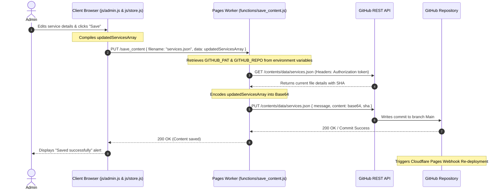
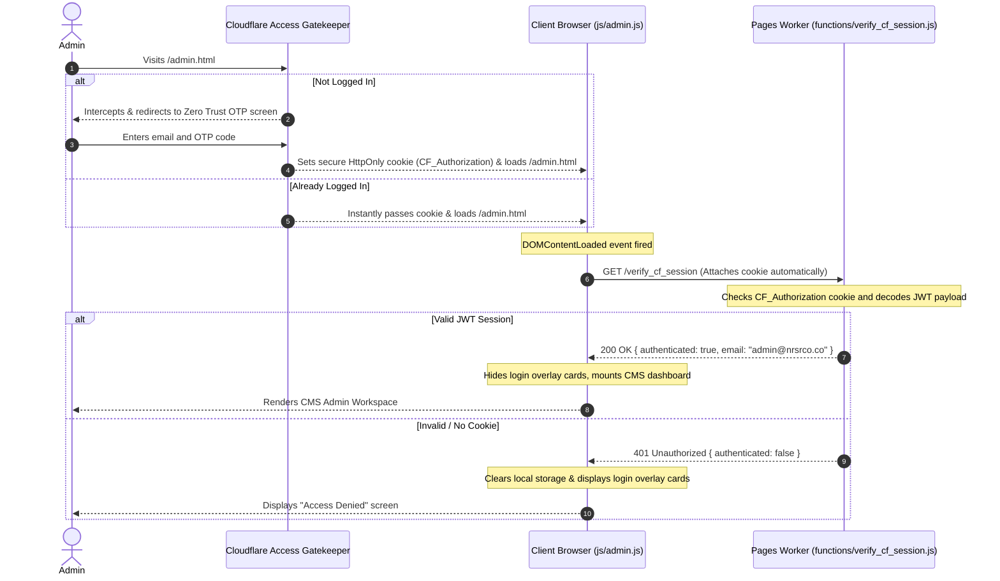
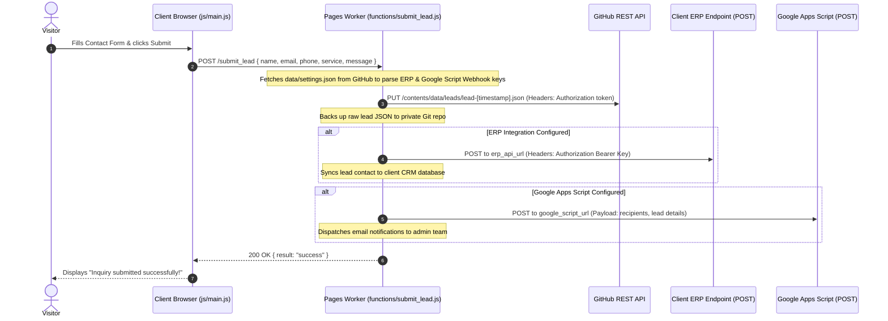

# The Serverless CMS & Git-as-a-Database Handover Bible

This document provides a comprehensive technical handover of the serverless architecture, database schemas, API lifecycles, and security integrations. It is structured to serve as an exhaustive reference for the CTO.

---

## 1. Architectural Paradigm

The application is built on a **Serverless Git-as-a-Database (GaaD)** paradigm. It hosts no active database servers, processes, or virtual machines, resulting in a **$0/month infrastructure cost**.

```
                           +----------------------------------------+
                           |             Client Browser             |
                           |  [Static HTML Pages, CSS, Javascript]  |
                           +-------------------+--------------------+
                                               |
                                    GET /      | POST /submit_lead
                                    Assets     | PUT /save_content
                                               v
+---------------------------------------------------------------------------------+
|                       Cloudflare Edge Network (Serverless)                      |
|                                                                                 |
|   +-----------------------+   +-----------------------+   +-----------------+   |
|   |   Cloudflare Access   |   |   verify_cf_session   |   |  github_proxy   |   |
|   |      (Zero Trust)     |   |    (JWT Assertion)    |   |  (API Tunnel)   |   |
|   +-----------------------+   +-----------------------+   +-----------------+   |
|                                                                                 |
+---------------------------------------------------------------------------------+
                                               |
                                     Secure    | Serverless
                                     Proxying  | Git Commits
                                               v
                           +-------------------+--------------------+
                           |             GitHub Perimeter           |
                           |       [Private Repo: Database]         |
                           +----------------------------------------+
```

### Key Pillars:
1.  **Static Edge Hosting**: Serves pre-rendered pages globally via Cloudflare Pages CDN.
2.  **Git-as-a-Database (GaaD)**: Structured JSON files in the `/data/` folder represent the system database. Writes are committed directly to the repository via the GitHub REST API.
3.  **Serverless Edge Compute (Workers)**: Isolated serverless JavaScript files in `/functions/` intercept POST, PUT, and DELETE operations, run security validation, append private tokens, and talk to GitHub's REST API.
4.  **Zero Trust Access Control**: Cloudflare Access acts as a network-level firewall protecting `/admin.html`. The application performs client-to-server cryptographic session handshakes using Cloudflare's edge JWT signatures.

---

## 2. File & Component Manifest

The project codebase is organized into discrete client-side and server-side components:

```
├── about.html                   # About company view
├── admin.html                   # CMS dashboard view & layout DOM
├── agency_replication_playbook.md # White-label duplication guide
├── assets/                      # Vector assets & dynamic images
├── blog-detail.html             # Blog post template (dynamically builds SEO schemas)
├── blogs.html                   # Blog grid archive listing
├── careers.html                 # Careers archive view
├── case-studies.html            # Case studies view
├── case-study-detail.html       # Case study detailed reader with dynamic SEO
├── contact.html                 # Inbound contact form page
├── css/
│   └── style.css                # Styling system, responsive grids, variables
├── data/                        # DATABASE SYSTEM (JSON flat files)
│   ├── blogs-index.json         # Blog index array for archive listings
│   ├── blogs/                   # Folder with individual blog detail contents
│   ├── case_studies-index.json  # Index of case study articles
│   ├── case_studies/            # Folder with individual case study detail contents
│   ├── faqs.json                # FAQ dataset
│   ├── leads/                   # Directory where incoming lead forms write JSON files
│   ├── services.json            # Core services array (16 primary offerings)
│   ├── settings.json            # Dynamic config (WhatsApp routing list, ERP credentials)
│   └── testimonials.json        # Client reviews dataset
├── functions/                   # SERVERLESS EDGE ACTIONS (Cloudflare Workers)
│   ├── auth.js                  # GitHub OAuth gateway (fallback login flow)
│   ├── callback.js              # GitHub OAuth callback gateway (fallback login flow)
│   ├── github_proxy.js          # API proxy for secure reads & deletes of lead files
│   ├── save_content.js          # Commits CMS JSON database changes to GitHub
│   ├── submit_lead.js           # Writes leads to Git + dispatches ERP/Email API webhooks
│   └── verify_cf_session.js     # Zero Trust cookie session authenticator
├── index.html                   # Website landing page
├── industries.html              # Target industries page
├── js/
│   ├── admin.js                 # CMS Admin interface views, handlers, delete/save binders
│   ├── main.js                  # Global scripts (lazy loads, SEO metadata parser, contact forms)
│   └── store.js                 # Shared state engine, cache layer, and serverless sync
├── robots.txt                   # Web crawler directions
├── services/                    # Specialized HTML landing pages for offerings
└── sitemap.xml                  # Search engine mapping
```

---

## 3. Database Schema & Data Models

The entire database is stored as raw JSON files in the `/data/` folder. The schemas are described below:

### 3.1. settings.json
Holds global system configurations.
*   **Path**: `data/settings.json`
*   **Schema**:
    ```json
    {
      "settings": {
        "whatsapp_numbers": [
          { "name": "Name String", "number": "Phone Number (digits only)" }
        ],
        "notification_emails": "email1@domain.com, email2@domain.com",
        "google_script_url": "HTTPS Apps Script Deployment URL for Email Triggering",
        "erp_api_url": "HTTPS API Endpoint for Lead ingestion",
        "erp_api_key": "Bearer BearerTokenKey"
      }
    }
    ```

### 3.2. services.json
Lists company offerings.
*   **Path**: `data/services.json`
*   **Schema**: Array of service categories, each containing sub-services:
    ```json
    [
      {
        "category": "Category Title",
        "items": [
          {
            "id": "unique-kebab-case-id",
            "title": "Service Title",
            "excerpt": "Short description shown on main list",
            "description": "Long-form service detail (HTML supported)",
            "link": "/services/service-detail-file.html",
            "icon": "SVG markup or Icon name"
          }
        ]
      }
    ]
    ```

### 3.3. testimonials.json
Client reviews.
*   **Path**: `data/testimonials.json`
*   **Schema**: Array of reviews:
    ```json
    [
      {
        "id": "timestamp-numeric",
        "name": "Client Name",
        "company": "Company Name",
        "role": "Client Job Title",
        "quote": "Text of the testimonial review",
        "rating": 5
      }
    ]
    ```

### 3.4. Index vs. Detail Partitioning (Blogs & Case Studies)
To keep page sizes minimal and optimize CDN caching, data is split:
1.  **Index Files (`blogs-index.json`, `case_studies-index.json`)**: Contains a lightweight array of posts with meta fields only. Used to render archive grids without loading thousands of words of blog contents.
2.  **Detail Files (`blogs/*.json`, `case_studies/*.json`)**: Individual records named `[slug].json` loaded dynamically only when a user visits the specific detail page.

#### Index Schema (e.g. `blogs-index.json`):
```json
[
  {
    "id": "timestamp-numeric",
    "title": "Article Title",
    "slug": "url-friendly-slug",
    "excerpt": "Excerpts shown in list",
    "date": "2026-08-06",
    "category": "Financial Advisory",
    "author": "Author Name",
    "read_time": "5 min read",
    "banner_image": "/assets/blog-banner.jpg"
  }
]
```

#### Detail Schema (e.g. `blogs/url-friendly-slug.json`):
```json
{
  "id": "timestamp-numeric",
  "title": "Article Title",
  "slug": "url-friendly-slug",
  "excerpt": "Excerpt text",
  "date": "2026-08-06",
  "category": "Financial Advisory",
  "author": "Author Name",
  "read_time": "5 min read",
  "banner_image": "/assets/blog-banner.jpg",
  "content": "Full markdown or rich HTML content of the article body..."
}
```

---

## 4. End-to-End Data Lifecycle

Below is the sequence execution flow when reading, writing, and deleting data inside the application.

### 4.1. Data Read Lifecycle
```
[Browser Loads Page]
       |
       +---> js/store.js invokes loadData()
                 |
                 +---> Fetches /data/services.json, data/testimonials.json, data/blogs-index.json
                 |     (Cached in localStorage and in-memory variables)
                 |
                 +---> [On Dynamic Detail Page, e.g., blog-detail.html?slug=my-post]
                           |
                           +---> js/store.js invokes getBlogDetails('my-post')
                                     |
                                     +---> Checks cache. If missing:
                                     +---> Fetches /data/blogs/my-post.json
```

### 4.2. CMS Save/Write Lifecycle (Sequence Diagram)
When an admin edits a service in `/admin.html` and clicks "Save":



---

## 5. Security & Session Handshake (Sequence Diagram)

To secure `/admin.html` without distributing GitHub developer account credentials, the site implements a Zero Trust Perimeter:



---

## 6. Lead Capture & Integration Pipelines (Sequence Diagram)

The lead capture lifecycle processes contact form inquiries.



---

## 7. Setup & Replication Guide (Spinning up new client websites)

Follow this step-by-step setup guide to duplicate this template and deploy a brand-new website for a new client in under 15 minutes.

### Step 1: Clone and Repository Initialization
1.  Create a **new private repository** on GitHub.
2.  Push all files from the website skeleton directory into this new repository.

### Step 2: Generate a GitHub Personal Access Token (PAT)
1.  Go to **GitHub Settings > Developer Settings > Personal Access Tokens > Tokens (classic)**.
2.  Click **Generate new token**.
3.  Name: `Client Website CMS Token`.
4.  Expiration: `No expiration`.
5.  Scopes: Check **`repo`** (gives full write access to private repositories).
6.  Click **Generate token** and copy it.

### Step 3: Deploy to Cloudflare Pages
1.  In your Cloudflare dashboard, navigate to **Workers & Pages > Pages** ➔ click **Create a project** ➔ select **Connect to Git**.
2.  Authorize GitHub, select the repository, and click **Begin setup**.
3.  Set build parameters:
    *   **Project name**: `client-website`
    *   **Production branch**: `Main`
    *   **Build command**: (Leave blank)
    *   **Build directory**: (Leave blank)
4.  Click **Save and Deploy**.
5.  Once the first deploy is complete, navigate to **Settings > Environment variables** under the Pages project:
    *   Add variable **`GITHUB_PAT`**: Paste your copied GitHub PAT token.
    *   Add variable **`GITHUB_REPO`**: `GitHubUsername/RepositoryName` (e.g. `NRSR_Coc/NRSR_Co-website`).
6.  Save settings.

### Step 4: Configure Cloudflare Zero Trust for the Admin Dashboard
1.  Go to your Cloudflare Zero Trust Console (one.dash.cloudflare.com).
2.  Go to **Access > Applications** ➔ click **Add an Application** ➔ select **Self-hosted**.
3.  Configuration:
    *   **Application name**: `Admin CMS`
    *   **Domain**: `client-website.pages.dev` (or your mapped custom domain).
    *   **Path**: `admin.html`.
4.  In the Policies section:
    *   **Rule name**: `CMS Admins`
    *   **Action**: `Allow`
    *   **Include**: **`Emails`** ➔ Enter the email addresses of the client managers who should have access.
5.  In the Identity Providers section:
    *   Check **One-time PIN** or **GitHub** (ensure they are activated under **Settings > Authentication** in the Zero Trust sidebar).
6.  Save the application.

### Step 5: Configure the Local Variables
1.  Open [`js/store.js`](file:///Users/likith/Documents/Client%20Websites/Sandeep%20website/js/store.js#L14-L15) in your new project.
2.  Modify the top variables to point to the new client's values:
    ```javascript
    window.GITHUB_REPOSITORY = 'Owner/NewRepoName';
    window.CLOUDFLARE_TEAM_DOMAIN = 'new-team-domain'; // Cloudflare team subdomain
    ```
3.  Commit and push to GitHub. Edge nodes will automatically rebuild and deploy!

---

## 🎨 White-Label UI Customization Guidelines

When adapting this codebase for a new client, you can completely change the styling, layouts, color schemes, and custom animations **without rewriting any JavaScript CMS logic**.

### Rules for the Design Handoff:
1.  **Do Not Break Selector Bindings**: Keep the HTML element IDs (such as `#contactForm`, `#loginZeroTrustBtn`, `#leadsTableBody`, `#servicesTableBody`) exactly as they are. The JS event loops bind to these IDs.
2.  **Custom Styling (CSS)**: The design system is controlled via root variables in [`css/style.css`](file:///Users/likith/Documents/Client%20Websites/Sandeep%20website/css/style.css). Modify the `--color-primary`, `--bg-main`, font families, and container dimensions to create an entirely new look (e.g., Glassmorphism dark mode or minimalist light mode).
3.  **HTML Layout Adjustments**: You can reorganize layout containers, divs, and graphics in `index.html`, `about.html`, etc. Just ensure the script bindings (`store.js` / `main.js`) remain loaded.

---

## 🛠️ Advanced Troubleshooting & HTTP Status Codes

When testing or debugging CMS integrations, watch the console logs or network responses. The Workers endpoint will return the following standard responses:

| Status Code | Meaning | Probable Cause | Corrective Action |
| :--- | :--- | :--- | :--- |
| **`200 OK`** | Success | Commit succeeded or lead capture processed. | No action required. |
| **`401 Unauthorized`** | Auth Failed | Invalid session token or `GITHUB_PAT` has expired. | Verify Cloudflare Access session cookie or regenerate GitHub PAT. |
| **`404 Not Found`** | Missing File | The requested file path in GitHub does not exist. | Verify `GITHUB_REPO` format and confirm database files exist in `/data/`. |
| **`409 Conflict`** | SHA Mismatch | Another admin updated the same file simultaneously. | Refresh the page to reload the latest database JSON content from GitHub. |
| **`500 Internal Error`**| Config Mismatch | Serverless environment variables are missing. | Verify `GITHUB_PAT` and `GITHUB_REPO` are set in the Cloudflare Pages settings. |
