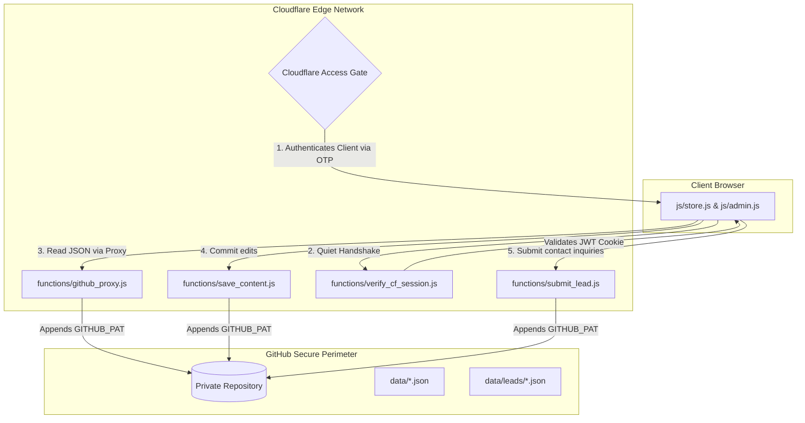

# CTO Handover & Architecture Verification Report

This report details the newly implemented **Cloudflare-Native Serverless CMS & Lead Capture Architecture** for the NRSR & Co website. 

---

## 🏗️ System Architecture Overview

The system operates on a **Git-as-a-Database (GaaD)** model. By storing structural datasets in version-controlled JSON files, we eliminate traditional SQL database clusters, server hosting costs, and standard CMS maintenance overhead, achieving a **$0/month infrastructure cost**.

---

## 🔒 Security & Session Isolation Blueprint

To protect client data and prevent malicious access to the private repository, the system implements a **layered trust architecture**:

### 1. Edge-Level Access Gateway (Zero Trust)
*   **Access Rules**: Cloudflare Access intercepts all requests to `/admin.html`. Users must authenticate via a One-Time PIN (OTP) sent to whitelisted company email domains.
*   **Cryptographic Assertion**: Upon successful authentication, Cloudflare Access sets a cryptographically signed, secure `HttpOnly` session cookie named `CF_Authorization`.

### 2. Quiet Session Handshake (Zero-Bypass Login)
*   **The Problem**: A malicious actor could bypass client-side routing and attempt to view the CMS dashboard UI directly.
*   **The Fix**: On page load, `js/admin.js` runs a silent handshake to the serverless function `/verify_cf_session`. The worker reads the `CF_Authorization` cookie, decodes the JWT, and verifies the user's authentication state. If invalid, the browser is instantly locked out and redirected to the login gate.

### 3. Token Insulation (Private API Tunneling)
*   **The Problem**: Traditional browser-to-GitHub CMS engines force clients to input or store GitHub Personal Access Tokens (PATs) in the browser, exposing them to cross-site scripting (XSS) extraction.
*   **The Fix**: The client browser never sees the GitHub token. All read, save, and delete requests are tunneled through server-side Cloudflare Pages Workers (`/functions/save_content.js` and `/functions/github_proxy.js`). The workers fetch the token (`GITHUB_PAT`) from Cloudflare's secure dashboard environment variables and append it to GitHub API requests server-side.

---

## 🔌 Lead Lifecycle & Integration Pipelines

The lead capture worker (`/functions/submit_lead.js`) processes inquiries submitted by prospective clients. It operates a dynamic three-stage pipeline based on the credentials set in `data/settings.json`:

1.  **Git Backup Log**: Saves the inquiry as a base64-encoded JSON record directly in `/data/leads/lead-[timestamp].json` within the private GitHub repository.
2.  **External CRM/ERP Synchronization**: If `erp_api_url` is configured, it transmits a secure server-to-server POST request containing lead contact details and target advisory services directly to your CRM endpoint.
3.  **Google Script Email Alerting**: If `google_script_url` is configured, it sends a payload to a Google Apps Script webhook to trigger email alerts containing message details to the admin distribution list.

---

## 🚀 Deployment & Rebuild Automation

Changes pushed to GitHub trigger automatic edge updates:
1.  **Commit Phase**: When an admin saves modifications inside the CMS dashboard, the worker commits the updated JSON file to the `Main` branch of the private GitHub repository.
2.  **Edge Sync**: GitHub fires a webhook event notifying Cloudflare Pages.
3.  **Build Phase**: Cloudflare Pages pulls the latest changes and builds/deploys the static files globally across its edge nodes (takes 1-2 minutes).

---

## ⚡ Caching & Performance Optimizations

To optimize page loading speeds and maximize Cloudflare Edge caching efficiency:
1.  **JSON Database Splitting**: Restructured heavy, flat JSON datasets (e.g. Blogs, Case Studies) into:
    *   **Index files** (e.g., `blogs-index.json`): Lightweight array of metadata (slug, title, date, excerpt) fetched immediately on archive pages.
    *   **Individual item files** (e.g., `blogs/post-slug.json`): Loaded dynamically only when a user opens the specific post, reducing initial load bandwidth.
2.  **SEO Schema Injection**: Built dynamic SEO headers inside `blog-detail.html` and `case-study-detail.html` that parse JSON files client-side and inject fully compliant `JSON-LD` schemas (e.g. `BlogPosting` and `Article`) automatically for web crawler bots.

---

## 🔍 Verification & Sign-off Checklist for the CTO

To verify the installation, ensure the following steps are tested:

1.  **Verify Endpoint Authorization**: Run a fetch to your live site at `/verify_cf_session` in a standard browser tab. It should return `401 Unauthorized` containing `{ "authenticated": false }`.
2.  **Verify Git Token Insulation**: Open the Chrome DevTools network tab while editing a service in the CMS. Confirm that **no** `Authorization: token GITHUB_PAT` header is sent from the browser. The only requests made should be to local endpoints `/save_content` and `/github_proxy`.
3.  **Confirm Zero-Bypass Rules**: Attempt to bypass login by setting `git_oauth_token = 'cloudflare_access'` manually in local storage and reloading. The handshake should fail, clear local storage, and redirect you to the login page immediately.
